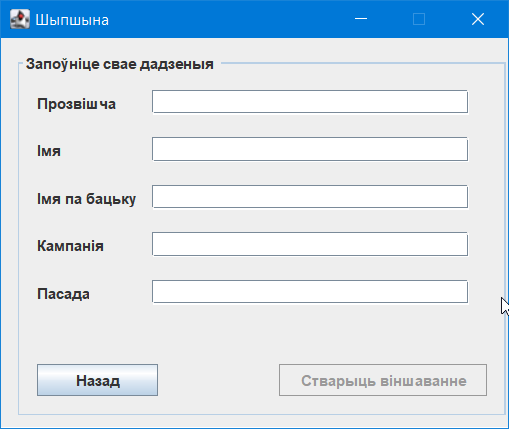
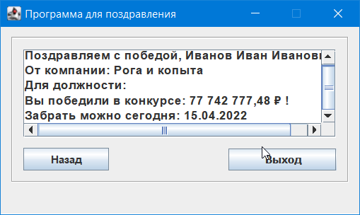

# ERM04_LAB6_2

Имя, фамилия студента | Группа  | Дисциплина  | Тема
----------------------|---------|-------------|---------
Сергей Ермолаев |	ВТИП-202с |	СООП	| Locales Win

Сделать 3-х оконную программу  со следующими возможностями:
1) В первом окне пользователь выбирает язык. После этого весь интерфейс программы (во всех окнах) должен быть на данном языке
2) Во втором окне пользователь заполняет свои анкетные данные в 5 (!) компонентах
3) В третьем окне выходят введенные пользователем данные в виде поздравления на выбранном языке
4) Сделать кнопки перехода по окнам и кнопку выхода из программы

