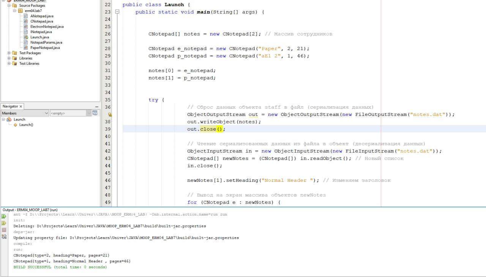

# ERM04_LAB7

Имя, фамилия студента | Группа  | Дисциплина  | Тема
----------------------|---------|-------------|---------
Сергей Ермолаев |	ВТИП-202с |	СООП	| Сериализация объектов

Сделать сериализацию объектов списка List из Задания 2 (для <класс4>) и их восстановление

