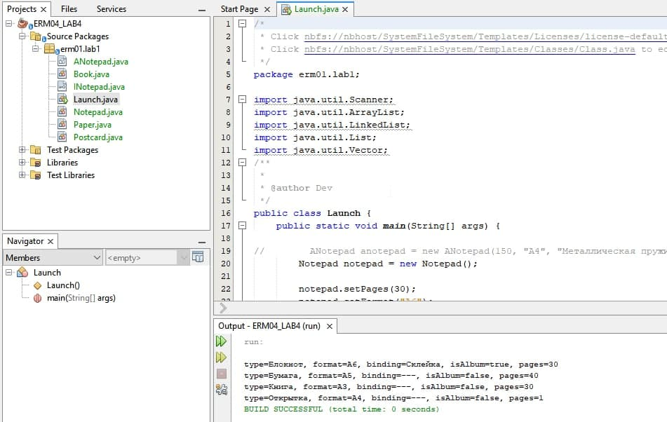

# ERM04_LAB1-2

Имя, фамилия студента | Группа  | Дисциплина  | Тема
----------------------|---------|-------------|---------
Сергей Ермолаев |	ВТИП-202с |	СООП	| Разработка классов и интерфейсов

4 Вариант. Блокнот. Создать программу из пяти окон, с возможностью последовательного перехода из одного окна в другое - вперед и назад. Данная программа должна выдавать справочную информацию об авторе в виде вопросов и ответов. Каждое окно программы должно быть посвящено определенному жизненному этапу.

Разработать программу для собственного класса4 (из Задания 1) с использованием трех коллекций: List (список), 
Set (множество), Map (отображение). Программа должна:
1) запросить количество элементов N
2) произвести циклический ввод всех элементов (объектов) N, добавляя каждый элемент 
в каждую из трех коллекций (список, множество, отображение)
3) в каждой коллекции удалить первый элемент и произвольно изменить последний элемент
4) вывести содержимое каждой из трех коллекций на экран, используя два вида циклов

