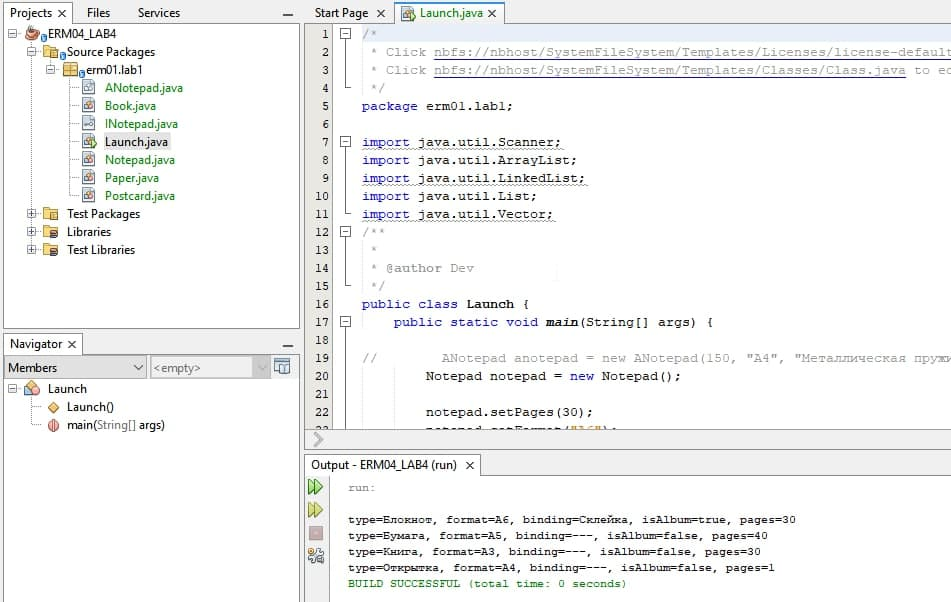

# ERM04_LAB3

Имя, фамилия студента | Группа  | Дисциплина  | Тема
----------------------|---------|-------------|---------
Сергей Ермолаев |	ВТИП-202с |	СООП	| -

4 Вариант. Блокнот. Создать программу из пяти окон, с возможностью последовательного перехода из одного окна в другое - вперед и назад. Данная программа должна выдавать справочную информацию об авторе в виде вопросов и ответов. Каждое окно программы должно быть посвящено определенному жизненному этапу.

