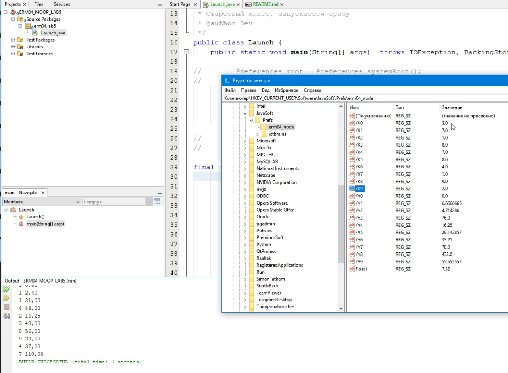

# ERM04_LAB5

Имя, фамилия студента | Группа  | Дисциплина  | Тема
----------------------|---------|-------------|---------
Сергей Ермолаев |	ВТИП-202с |	СООП	| Prefs

4 Вариант. 4. Определить, имеется ли в таблице хотя бы один нулевой элемент. Если такой элемент есть, то заменить все вещественные значения таблицы единицами  

