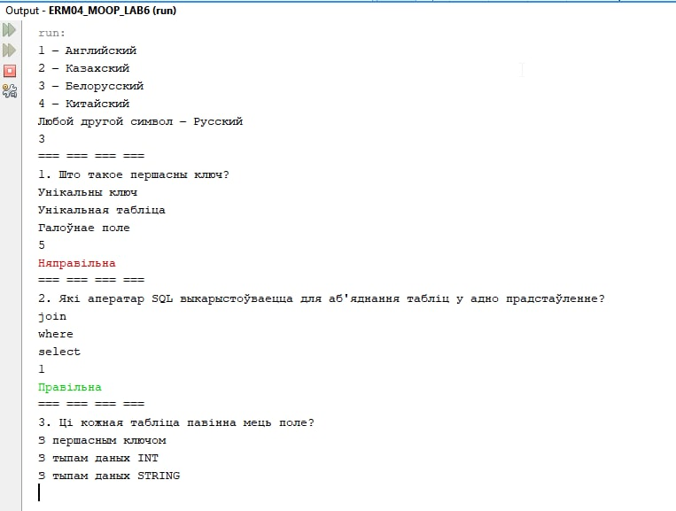

# ERM04_LAB6_1

Имя, фамилия студента | Группа  | Дисциплина  | Тема
----------------------|---------|-------------|---------
Сергей Ермолаев |	ВТИП-202с |	СООП	| Locales

Сделать консольную программу, взаимодействующуй с пользователем, на 5 языках. 
В программе предумотреть 3 вопроса и 3 ответа для всех языков!

